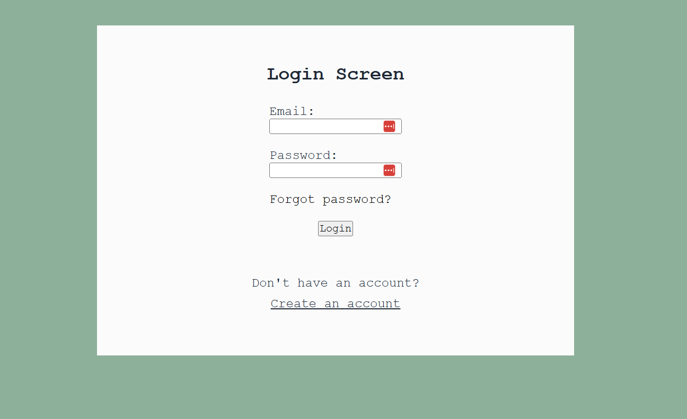
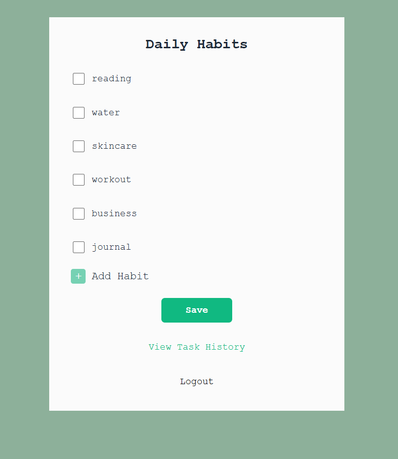
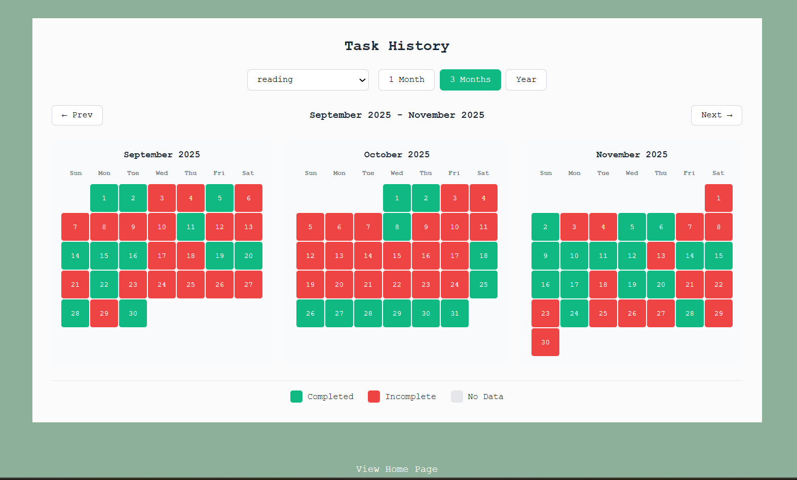

# Habit Tracker

**- A WORK IN PROGRESS**

A full-stack habit tracking web app built with Flask, Supabase, and JavaScript. Track your daily habits, view completion history, and stay consistent.

---

## Screenshots

### Login / Register


### Dashboard


### History


---

## Features

- User authentication (register, login, forgot/reset password)
- Create and delete daily habits
- Mark habits as complete each day
- View completion history
- In-memory caching for fast page loads (TTL cache)

## Tech Stack

- **Backend:** Python, Flask
- **Database:** Supabase (PostgreSQL)
- **Frontend:** HTML, CSS, JavaScript
- **Deployment:** Railway (currently disabled)

## Setup

1. Clone the repo
2. Create a `.env` file with the following:
   ```
   SECRET_KEY=your_secret_key
   SUPABASE_URL=your_supabase_url
   SUPABASE_ANON_KEY=your_supabase_anon_key
   ```
3. Install dependencies:
   ```bash
   pip install -r requirements.txt
   ```
4. Run the app:
   ```bash
   python habits.py
   ```
